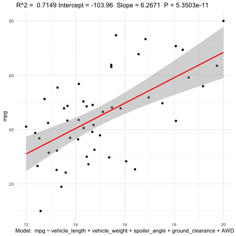
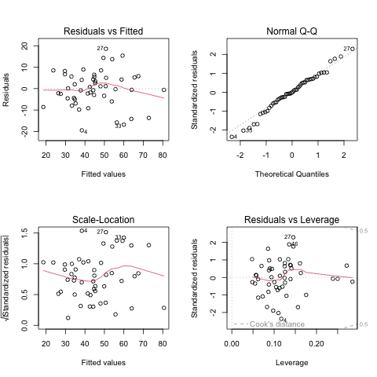
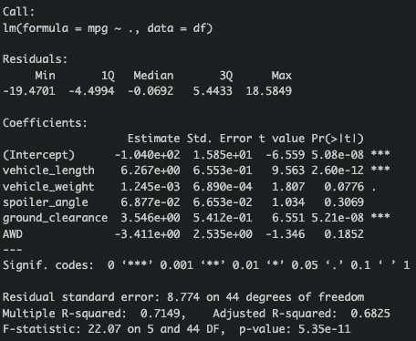
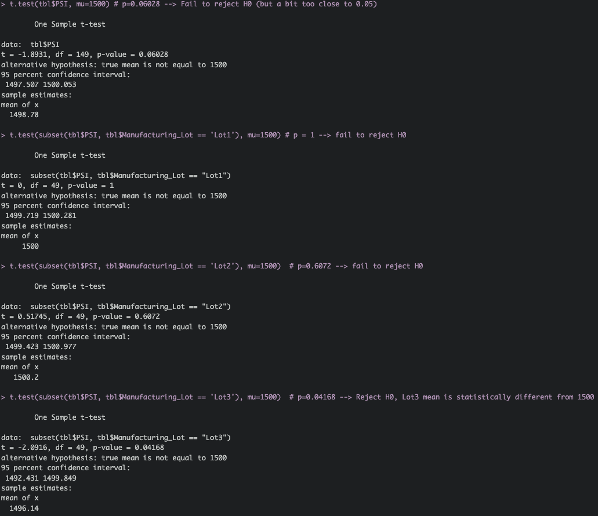

# MechaCar Statistical Analysis

## Linear Regression to Predict Fuel Economy (MPG)

A linear model was constructed to predict fuel economy (MPG) of MechaCar prototypes based on other variables avariable (Vehicle Length, Weight, Spoiler Angle, Ground Clearance, and AWD). 

*Linear Model of mpg ~ Length + Weight + Spoiler Angle + Ground Clearance + AWD with 95% Confidence Interval*

Additonally, diagnostic plots of the model show that the conditions of linearity, homoscedasticity, indepedence, and normality are met. Thus, this is a valid model.

*Diagnostic Plots of linear model show that assumptions are met*

The model was found to be highly significant (p = 5.35E-11) and explained roughly 70% of the variation in the dependent variable (R2 = 0.7149). Thus, H0 can be rejected in favor of HA, i.e. the slope is statistically different from zero. The model indicates that vehicle weight and ground clearance are highly significant predictors (p << 0.05 for both). Since the model is valid and R2 > 0.7, it can be concluded that there is a strong relationship between the predictors and mpg and that this model is effective.

*Summarized Results of linear model, p = 5.35E-11, R2 = 0.7149*

## Statistical Summary of Suspension Coils

A statistical analysis of the weight capacities measured in pounds per square inch (PSI) for suspension coils shows that the variance across lots is 62. However, the variance in PSI for Lot 3 suspension coils is 170, greatly exceeding the variance of PSI in Lots 1 and 2 and cutoff-value of 100. This data indicates that there is an issue with Lot 3 and they should not be pushed to production.

## T-Tests of Suspension Coils

A t-test of the weight capacities for suspension coils manufactured MechaCar indicate there a low level of statistical difference (p = 0.06028) between the mean PSI of current lots and the desired mean of 1500. Further t-tests for each lot indicate that Lot 3 is statistically different from 1500 (p=0.04168) while the other two lots meet the specification (p > 0.6 for both Lot 1 and Lot 2). This data further corroborates the previous conclusion that Lot 3 suspension coils should not be used in the production of MechaCars.

*Results of inter- and intra-lot t-tests conducted on mean weight capacities of suspension coils*

## Experimental Design: Linear Regression of Vehicle Design to Predict Vehicle Lifetime Fatality Chance and Vehicle Lifetime Injury Chance

Vehicle crash safety is one of the most important considerations consumers make when deciding to purchase a new vehicle. Popular sources of safety information include the <a href="https://www.nhtsa.gov/ratings" target="_blank">NHTSA 5-star safety rating program</a> (which rates safety from 1-5 based on results of frontal collision test, side-barrier crash test, side pole crash test, and rollover resistance) and the <a href="https://www.iihs.org/ratings/top-safety-picks" target="_blank">IIHS Top Safety Picks</a>